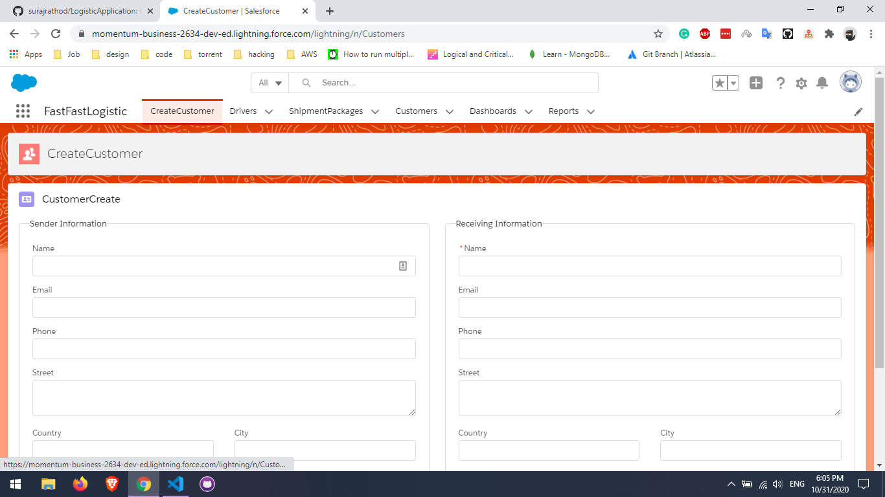

# FASTFASTLOGISTIC

logistic Application where you can create Customer, create the shipment for the customer,create the driver.

## OBJECTS

- Customer (Basic Information)
- Drivers (Basic Information)
- Quotation 
- ShipmentPackage

## Feature
- Use the Lightning Web Component to create new Customer Record.
- when the new Shipment is Created for the Customer create the Quotation **using TRIGGER** .
- Generate Invoice for the Shipment **BUTTON** using **vfp**.
- Timely Notification to the Customers about their Orders .

 
# Installation Process

## Installing the app using a Scratch Org

1. Set up your environment. Follow the steps in the [Quick Start: Lightning Web Components](https://trailhead.salesforce.com/content/learn/projects/quick-start-lightning-web-components/) Trailhead project. The steps include:

    - Enable Dev Hub in your Trailhead Playground
    - Install Salesforce CLI
    - Install Visual Studio Code
    - Install the Visual Studio Code Salesforce extensions, including the Lightning Web Components extension

2. If you haven't already done so, authorize your hub org and provide it with an alias (**DevHubDefault** in the command below):
   
   You can give your DevHub Org any name

    ```
    sfdx force:auth:web:login -d -a DevHubDefault
    ```

3. Clone the SalesforceEagluet repository:

    ```
   git clone https://github.com/surajrathod/LogisticApplication.git
    cd LogisticApplication
    ```

4. Create a scratch org and provide it with an alias (**LogisticApplication** in the command below):

    ```
    sfdx force:org:create -s -f config/project-scratch-def.json -a LogisticApplication
    ```

5. Push the app to your scratch org:

    ```
    sfdx force:source:push
    ```

6. Open the scratch org:

    ```
    sfdx force:org:open
    ```
7. In App Launcher, select the **FastFastLogistic** app.